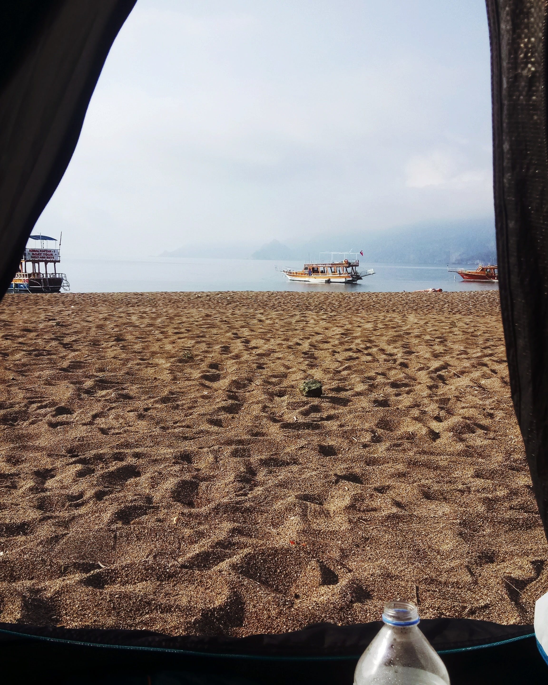

    

It was during my university years that I had my first taste of the wild. With money saved from my part-time job, I finally purchased a tent—a small investment that promised countless adventures. Living in a place like Denizli, the opportunities for camping were abundant. I had the luxury of having İzmir, Muğla and Antalya just a stone's throw away, not to mention the hidden gems of Burdur and Isparta, which were practically in my backyard.

The city that truly captivated me was Antalya. I had the chance to camp in breathtaking spots like Çıralı, Olimpos, and Adrasan. My adventures often began with a simple gesture—raising my thumb and hitchhiking my way through the scenic roads. Along the journey, I met fascinating people, each with their own unique story. Listening to their life experiences not only filled me with inspiration but also added a deeper layer to my travels.

I hitchhiked so often from Denizli to Antalya that I would end up running into the same drivers a few times a year. The people I met along the way were an incredible part of my journey. Some were fellow adventurers, sharing stories and tips around a campfire. Others were locals, who offered a glimpse into the culture and traditions of the region. Every interaction, no matter how brief, left me feeling inspired and taught me that life is as much about the journey as it is about the destination.

But driving myself, the experience just wasn't the same. The thrill of spontaneity and the connections I made along the way were missing. It made me realise that the real joy of these trips wasn't just getting there, but the unexpected moments and people that turned a simple journey into an adventure.

